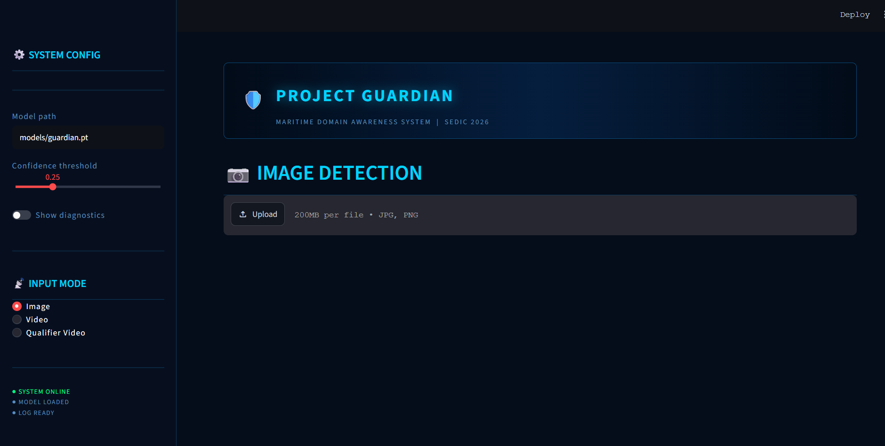

# SEDIC2026<div align="center">

# 🛡️ Project Guardian
### Maritime Domain Awareness System
**SEDIC 2026 — Track 2: Object Detection**


</div>

---

## 📌 Overview



Project Guardian is a real-time Maritime Domain Awareness (MDA) system capable of detecting and classifying vessels from image and video inputs. Built for SEDIC 2026 Track 2, the system uses a fine-tuned YOLOv8s model trained on 17,193 annotated maritime images across 11 vessel classes.

---

## 🎯 Detection Classes

| Category | Classes | Threat Level |
|---|---|---|
| 🟢 Civilian | `container_ship`, `tanker`, `cargo`, `passenger_ferry`, `tugboat` | CIVILIAN |
| 🟡 Small Craft | `yacht`, `speedboat`, `fishing_boat` | SMALL CRAFT |
| 🟠 Monitor | `patrol_boat` | MONITOR |
| 🟠 Military (Local) | `local_military_ship` | PRIORITY |
| 🔴 Military (Foreign) | `foreign_military_ship` | HIGH PRIORITY |

---

## 🗂️ Project Structure

```
Project/
├── app.py                  # Main Streamlit GUI
├── detector.py             # YOLOv8 inference wrapper
├── log_writer.py           # Detection log (CSV) writer
├── run_qualifier.py        # Standalone qualifier video script
├── utils/
│   ├── __init__.py
│   └── colours.py          # Threat colour + level mapping
├── models/
│   └── guardian.pt         # Trained model weights (not in repo — see below)
├── data/
│   └── qualifier_clip.mp4  # Qualifier video (place here)
├── outputs/
│   └── *.csv               # Detection logs (auto-generated)
└── requirements.txt
```

---

## ⚙️ Setup

### 1. Clone the repo

```bash
git clone https://github.com/syardnl/SEDIC2026.git
cd SEDIC2026
```

### 2. Create virtual environment

```bash
python -m venv venv

# Windows
venv\Scripts\activate

# Mac / Linux
source venv/bin/activate
```

### 3. Install dependencies

```bash
pip install -r requirements.txt
```

### 4. Download model weights

`guardian.pt` is not included in this repo due to file size. Download it from the shared Google Drive and place it in the `models/` folder:

```
models/guardian.pt
```

> Contact the team for the Drive link.

### 5. Run the app

```bash
streamlit run app.py
```

Open `http://localhost:8501` in your browser.

---

## 🖥️ GUI Features

| Feature | Description |
|---|---|
| **Image mode** | Upload JPG/PNG → instant detection with bounding boxes |
| **Video mode** | Upload MP4 → real-time frame-by-frame processing |
| **Qualifier Video mode** | Run model on official qualifier clip → generate submission log |
| **Military alert** | 🔴 Pulsing red alert for foreign military / 🟠 Orange alert for local military |
| **Metric cards** | Live count of Total / Military / Civilian / Threats |
| **Confidence slider** | Adjust detection threshold (0.01 – 0.95) |
| **Model diagnostics** | Toggle debug panel showing model info and low-threshold probe |
| **CSV download** | One-click download of detection log after each run |

---

## 📋 Detection Log Format

All detection runs produce a CSV log with these columns:

| Column | Description |
|---|---|
| `timestamp` | UTC timestamp (ISO 8601) |
| `frame_id` | Frame number (0 for images) |
| `class_name` | Detected vessel class |
| `threat_level` | CIVILIAN / SMALL CRAFT / MONITOR / PRIORITY / HIGH PRIORITY |
| `confidence` | Model confidence (0.000 – 1.000) |
| `x1, y1, x2, y2` | Bounding box coordinates (pixels) |

### Example

```csv
timestamp,frame_id,class_name,threat_level,confidence,x1,y1,x2,y2
2026-08-14T08:32:11.042Z,0,local_military_ship,PRIORITY,0.882,104,87,743,498
2026-08-14T08:32:11.042Z,0,container_ship,CIVILIAN,0.951,210,300,890,640
```

---

## 🎬 Qualifier Video — Submission

1. Place the official qualifier clip at `data/qualifier_clip.mp4`
2. Open the app → select **Qualifier Video** mode
3. Click **▶ RUN AND GENERATE LOG**
4. Download `qualifier_detection_log.csv` from the app
5. Submit the CSV as part of the competition package

Or run standalone (no GUI needed):

```bash
python run_qualifier.py
```

Output saved to `outputs/qualifier_detection_log.csv`.

---

## 🏗️ Model

| Detail | Value |
|---|---|
| Architecture | YOLOv8s |
| Input size | 640 × 640 |
| Classes | 11 |
| Training instances | 17,193 |
| Dataset sources | SeaShips, Singapore Maritime Dataset, Roboflow Universe |
| Dataset license | CC BY 4.0 |

---

## 👥 Team

| Role | Responsibility |
|---|---|
| #1 & #2 — Model & Multi-view | YOLOv8 architecture, training pipeline, recall optimization |
| #3 — Data Engineer | Dataset sourcing, curation, labeling, class taxonomy |
| #4 — GUI & Detection Log | Streamlit GUI, inference pipeline, detection log generation |
| #5 — Data Analyst / Storyteller | Technical brief, confusion matrix, submission checklist, demo video |

---

## 📦 Requirements

```
streamlit>=1.61
ultralytics>=8.0
opencv-python
pillow
httpx
numpy
```

Install all:

```bash
pip install -r requirements.txt
```

---

<div align="center">
Built for <strong>SEDIC 2026</strong> · Track 2 — Maritime Vessel Detection
</div>